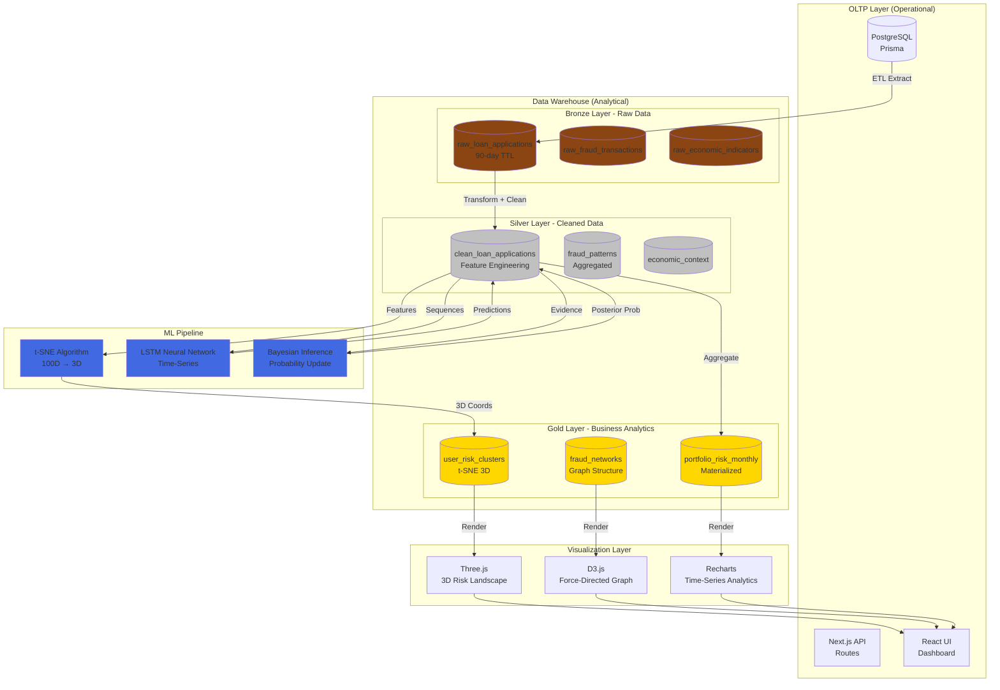

# LendGuard AI Architecture Overview

## Data Flow Explanation

### 1. OLTP → Bronze (Extraction)
**Frequency:** Every 24 hours (configurable)
- PostgreSQL loan applications → `raw_loan_applications`
- IEEE-CIS fraud data → `raw_fraud_transactions`
- FRED economic API → `raw_economic_indicators`

**Retention:** 90 days (automatic TTL cleanup)

### 2. Bronze → Silver (Transformation)
**Processing:**
- Data quality scoring (0-100)
- Feature engineering:
  - `income_to_loan_ratio = income / loan_amount`
  - `employment_stability = months_employed / age`
- Risk categorization (LOW/MEDIUM/HIGH/CRITICAL)

**Retention:** 2 years

### 3. Silver → Gold (Aggregation)
**Business Logic:**
- Monthly portfolio risk summaries
- t-SNE dimension reduction (100D → 3D)
- Fraud network graph construction

**Retention:** Indefinite (archived after 5 years)

### 4. ML Pipeline Integration
- **t-SNE:** Runs during Silver → Gold transformation
- **LSTM:** Trained separately, predictions stored in Silver
- **Bayesian:** Real-time inference during API requests

### 5. Visualization Rendering
- **Three.js:** Reads `user_risk_clusters` (Gold layer)
- **D3.js:** Reads `fraud_networks` (Gold layer)
- **Recharts:** Reads `portfolio_risk_monthly` (Gold layer)

## Performance Characteristics

| Layer  | Storage Format | Query Speed | Use Case |
|--------|----------------|-------------|----------|
| Bronze | Row-oriented   | ~100ms      | Audit trail, raw backup |
| Silver | Column-oriented| ~20ms       | Feature engineering, ML training |
| Gold   | Aggregated     | ~5ms        | Dashboard visualization |

## Academic Concepts Applied

1. **Data Warehouse (Course):** Medallion architecture, OLTP vs OLAP separation
2. **Dimension Reduction (Course):** t-SNE algorithm for 3D projection
3. **Neural Networks (Course):** LSTM for time-series default prediction
4. **Mathematical Inference (Course):** Bayesian updating for probability
5. **Data Mining (Course):** Apriori algorithm for fraud patterns
6. **Visualization (Course):** 3D rendering with Three.js

---

**Created:** 2024-02-04  
**Version:** 2.0  
**Status:** Phase 1 Implementation Ready
